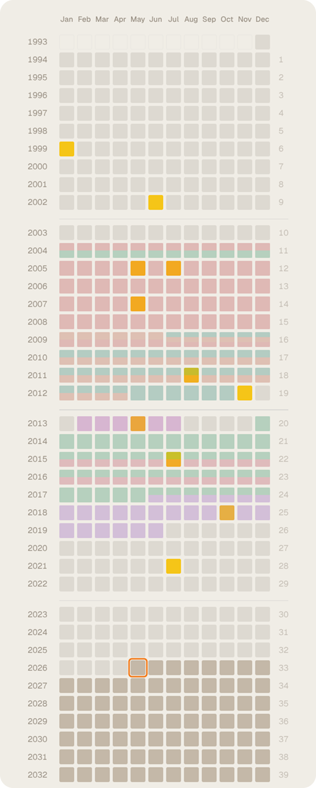

# awhile

[](https://www.gnu.org/licenses/agpl-3.0)

**awhile** is a personal life timeline application that renders your life as a scrollable grid of months, with one row per year. It allows you to add notes to any month and mark life periods with color-coded range tags.



## Features

- **Visual Life Grid:** See your entire life at a glance, organized by years and months.
- **Monthly Notes:** Capture memories, milestones, or thoughts for any specific month.
- **Color-Coded Tags:** Mark significant life periods (e.g., "University," "Living in Berlin," "First Job") with range tags.
- **Self-Hosted & Private:** All data is stored locally — no cloud, no tracking.

---

## Quick Start

### Prerequisites

- [Node.js](https://nodejs.org/) 20+
- [Git](https://git-scm.com/)
- [PM2](https://pm2.keymetrics.io/) (`npm install -g pm2`)

### Installation

1. Clone the repository:
   ```bash
   git clone https://github.com/kt3u/awhile
   cd awhile
   ```

2. Install dependencies:
   ```bash
   npm install
   ```

3. Start with PM2 (builds automatically, then starts the server):
   ```bash
   pm2 start ecosystem.config.cjs
   ```

4. (Optional) Auto-start on system reboot:
   ```bash
   pm2 save
   pm2 startup
   ```

5. Open your browser and navigate to [http://localhost:3001](http://localhost:3001).

> **Without PM2:** `npm start` also works — it builds and starts the server in one step.

---

## Maintenance

### Updating

To update to the latest version:

```bash
git pull
npm install
pm2 restart awhile
```

The restart automatically rebuilds the frontend before launching.

### Data & Backups

All your data lives in the `./data/` directory, created automatically on first run:

- `data/awhile.json` — notes, tags, and settings (plain JSON)
- `data/images/` — uploaded images referenced by notes

**To create a backup:**
```bash
cp -r data/ data.backup/
```

---

## Contributing

Contributions are welcome! Please see [CONTRIBUTING.md](.github/CONTRIBUTING.md) for guidelines.

## License

This project is licensed under the **GNU Affero General Public License v3.0 (AGPL-3.0)**. See the [LICENSE](LICENSE) file for the full text.
